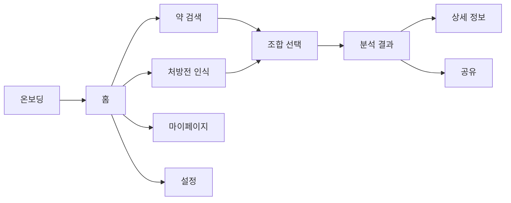

# Medication Interaction Guide App

> 약, 음식, 영양제의 상호작용을 모바일 중심 UX로 안내하는 React 기반 웹 앱

## Overview

이 프로젝트는 사용자가 복용 중인 약과 함께 먹는 음식, 영양제를 조합해 상호작용 위험도를 빠르게 확인할 수 있도록 만든 프론트엔드 앱입니다.

## Key Features

- 약 검색 후 복용 목록 구성
- 처방전 이미지 기반 OCR 흐름
- 약 + 음식 + 영양제 조합 분석
- 위험도별 결과 요약 및 상세 안내
- 분석 기록 저장, 공유, 마이페이지 관리

## Quick Start

### Requirements

- Node.js 20 이상 권장
- `pnpm` 사용 권장

### Install

```bash
pnpm install
```

### Run Dev Server

```bash
pnpm dev
```

### Build

```bash
pnpm build
```

### Lint

```bash
pnpm lint
```

## Tech Stack


| 영역        | 사용 기술                                       |
| --------- | ------------------------------------------- |
| Framework | React, TypeScript, Vite                     |
| Routing   | `react-router`                              |
| Styling   | Tailwind CSS v4, CSS Variables              |
| UI Base   | Radix UI 기반 컴포넌트, `src/app/components/ui/*` |
| Icons     | `lucide-react`                              |
| State     | React Context + `useReducer`                |


추가로 `package.json`에는 `react-hook-form`, `motion`, `clsx`, `class-variance-authority`, `tailwind-merge` 등이 포함되어 있습니다.  
다만 현재 코드에서 핵심적으로 보이는 조합은 `React + react-router + Tailwind + Radix 스타일 UI + lucide-react`입니다.

## App Flow




## Project Structure

```text
src/
  App.tsx
  main.tsx
  app/components/ui/         # 버튼, 다이얼로그, 탭 등 UI primitive
  components/
    common/                  # 공통 UI 조합 컴포넌트
    layout/                  # 헤더, 하단 네비, 페이지 셸
  contexts/                  # User, Medicine, Analysis 상태
  hooks/                     # 화면 로직용 커스텀 훅
  mock/                      # 목업 데이터
  pages/                     # 라우트 단위 페이지
  services/                  # 분석, OCR, 검색 서비스
  styles/                    # Tailwind, theme, globals
  types/                     # 도메인 타입
docs/
  ux-ui/                     # UX/UI 핸드오프 문서
```

## Important Files

- `src/App.tsx`: 전체 라우트 진입점
- `src/components/layout/PageContainer.tsx`: 공통 페이지 레이아웃 셸
- `src/contexts/*`: 전역 상태 관리
- `src/pages/*`: 실제 사용자 화면
- `src/styles/theme.css`, `src/styles/globals.css`: 토큰, 전역 스타일, 접근성 관련 설정

## UX/UI Docs

상세 UX/UI 문서는 아래에서 확인할 수 있습니다.

- [UX/UI README](./docs/ux-ui/README.md)
- [Project Overview](./docs/ux-ui/00-project-overview.md)
- [Current State](./docs/ux-ui/01-current-state.md)
- [Design System](./docs/ux-ui/02-design-system.md)
- [Page Improvements](./docs/ux-ui/03-page-improvements.md)
- [Priority Backlog](./docs/ux-ui/04-priority-backlog.md)
- [AI Collaboration Guide](./docs/ux-ui/05-ai-collaboration-guide.md)

## Recommended First Tasks

1. `seniorMode`를 실제 루트 DOM에 연결
2. 하단 고정 CTA 패턴 공통화
3. 검색 결과 없음/로딩/선택 상태 정리
4. 결과 화면에서 고위험 정보 우선순위 강화

## Notes

- 현재 `package.json`에는 `dev`, `build`, `lint`, `lint:fix`가 정의되어 있습니다.
- `test`, `preview` 스크립트는 아직 없습니다.
- 이 앱은 의료 안전 정보를 다루므로, 시각적 화려함보다 명확한 정보 전달과 접근성이 우선입니다.
